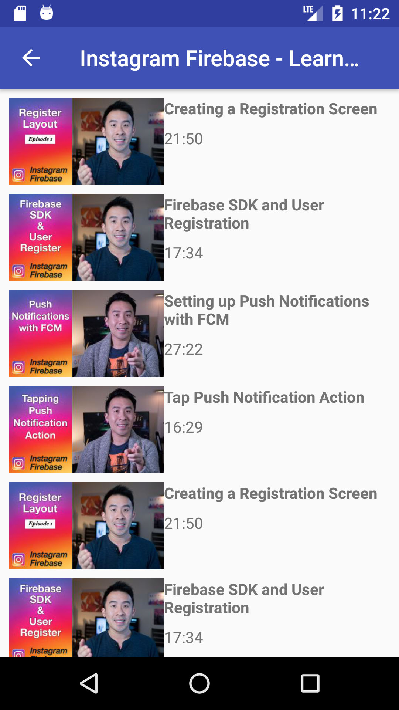
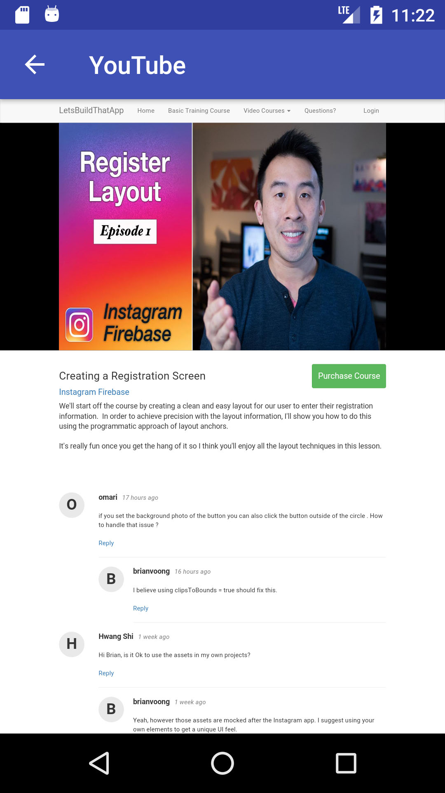

# Android-Kotlin-old

Exploring basics of Kotlin.
#
#
Building simple YouTube demo app.

#
Feeds screen:
- shows a list of youtube feeds from specific youtube channel
- selecting a feed shows connected stories

  
 
#
Stories screen:
- shows a list of stories for the selected feed
- parsing json with gson
- cashing images with picasso

  
 
#
WebView screen: 
- shows selected storie on web

  

#
Core Features:
- Custom cells, XML
- RecycleView
- Parsing JSON
- Cashing images
- WebView
